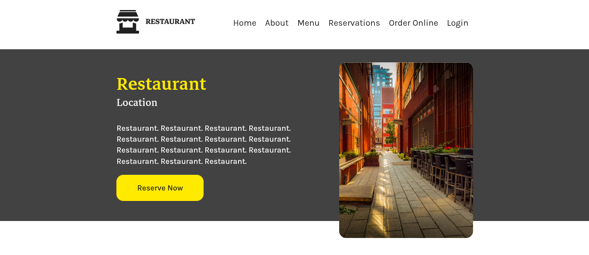

# react-restaurant

The concepts I implemented into the project are mainly Flexbox, Grid CSS and React components. This project helped me understand standards of designing websites from scratch, implementing the design, understanding client's needs and coding web applications so they can be easily expanded in future.

## Run online in IDE

| Project link | Info | Version |
|-----|-----|-----|
|🗃️ [Open in CodeSandbox](https://codesandbox.io/s/github/krzysztofc-git/react-restaurant)| Run using a web container in your browser | Always latest build |

## Documentation

### Installation

To run this project locally:

1. Run `npm install` to install dependencies
2. Use `npm start` to start the development server
3. Run `npm test` to execute tests

### Technologies Used

- React.js
- CSS (Flexbox & Grid)
- Figma (for design)
- Create React App

### Features

Key features of the application include:

- Responsive design
- Interactive form components
- Modular component structure
- CSS Grid and Flexbox layouts

### Firma design Wireframe and the result

### Preview - Desktop

### Preview - Form

### Preview - Mobile
